<div align="center">

# EduDocs AI

Agente de IA para consultar documentos educacionais fictícios com respostas rastreáveis, fontes e recusas seguras.

[](https://github.com/brodyandre/edudocs-ai-agent-oci/actions/workflows/quality.yml)
[](https://github.com/brodyandre/edudocs-ai-agent-oci/actions/workflows/api-ci.yml)
[](https://github.com/brodyandre/edudocs-ai-agent-oci/actions/workflows/web-ci.yml)
[](https://github.com/brodyandre/edudocs-ai-agent-oci/actions/workflows/containers-ci.yml)
[](LICENSE)

[Demonstração](#demonstracao-da-experiencia) ·
[Arquitetura](#arquitetura) ·
[Execução local](#execucao-local) ·
[Avaliação](#qualidade-e-avaliacao) ·
[GitHub Actions](#github-actions)

</div>

---

## Proposta de valor

Documentos extensos costumam esconder regras importantes em páginas diferentes. O EduDocs AI permite perguntar em linguagem natural, receber uma resposta curta e conferir de onde veio cada informação. Quando o corpus não sustenta a pergunta, o agente deve recusar em vez de completar com conhecimento externo.

O projeto usa uma aplicação educacional fictícia, a EduDocs Academy, para demonstrar um fluxo RAG completo sem expor dados reais.

## Índice

- [Demonstração da experiência](#demonstracao-da-experiencia)
- [Problema resolvido](#problema-resolvido)
- [Como funciona](#como-funciona)
- [Como o agente responde](#como-o-agente-responde)
- [Quando a informação não existe](#quando-a-informacao-nao-existe)
- [Documentos disponíveis](#documentos-disponiveis)
- [Experiência para pessoas não técnicas](#experiencia-para-pessoas-nao-tecnicas)
- [Arquitetura](#arquitetura)
- [Tecnologias](#tecnologias)
- [Qualidade e avaliação](#qualidade-e-avaliacao)
- [GitHub Actions](#github-actions)
- [Docker e execução integrada](#docker-e-execucao-integrada)
- [Release de containers](#release-de-containers)
- [Execução local](#execucao-local)
- [Perguntas de exemplo](#perguntas-de-exemplo)
- [Segurança](#seguranca)
- [Estrutura do repositório](#estrutura-do-repositorio)
- [Estado do projeto](#estado-do-projeto)
- [Infraestrutura OCI](#infraestrutura-oci)
- [Evidências do deploy OCI](#evidencias-do-deploy-oci)
- [Entregáveis do Challenge](#entregaveis-do-challenge)
- [Limitações](#limitacoes)
- [Roadmap](#roadmap)
- [Licença](#licenca)
- [Autor](#autor)

## Demonstração da experiência

A primeira tela foi pensada para pessoas que não querem entender termos técnicos antes de usar o sistema. O hero mantém a promessa central do produto: **Pergunte aos documentos. Entenda a resposta.** O ícone documental reforça a ideia de pergunta, análise e fonte, sem competir com a ação principal.

<!-- EVIDENCE:HOME:START -->
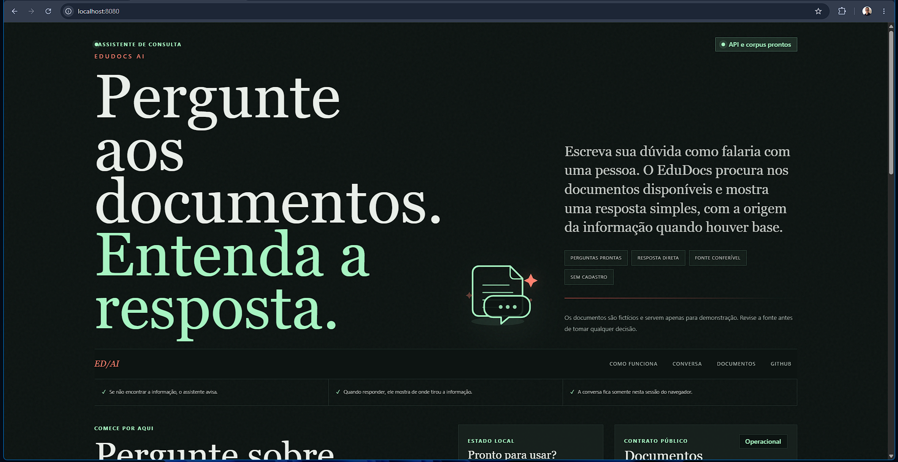

_Hero da interface de consulta documental._
<!-- EVIDENCE:HOME:END -->

[Voltar ao índice](#índice)

## Problema resolvido

O cenário simulado é comum em ambientes educacionais: regras de certificado, reembolso, privacidade, matrícula e aprovação ficam distribuídas em PDFs. A consulta manual é lenta, exige familiaridade com o vocabulário institucional e pode levar a respostas sem rastreabilidade.

O EduDocs AI resolve esse recorte ao buscar trechos relevantes, responder apenas com base no corpus e mostrar documento, página e trecho usado. O público esperado inclui estudantes, equipes acadêmicas e avaliadores que precisam validar rapidamente se a resposta tem origem verificável.

[Voltar ao índice](#índice)

## Como funciona

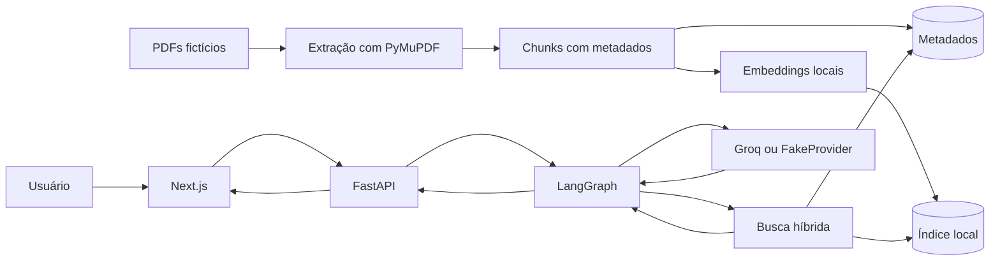
```mermaid
flowchart LR
    PDF[PDFs fictícios] --> TXT[Extração com PyMuPDF]
    TXT --> CH[Chunks com metadados]
    CH --> EMB[Embeddings locais]
    EMB --> IDX[(Índice local)]
    CH --> META[(Metadados)]
    USER[Usuário] --> WEB[Next.js]
    WEB --> API[FastAPI]
    API --> GRAPH[LangGraph]
    GRAPH --> RET[Busca híbrida]
    RET --> IDX
    RET --> META
    RET --> GRAPH
    GRAPH --> LLM[Groq ou FakeProvider]
    LLM --> GRAPH
    GRAPH --> API
    API --> WEB
```

O fluxo começa com PDFs fictícios do corpus. A API extrai texto, cria chunks, gera embeddings locais e salva índice e metadados. Durante uma pergunta, o grafo LangGraph consulta o recuperador híbrido, avalia se há evidência suficiente e só então solicita a resposta ao provedor configurado.

<details>
<summary>Detalhes técnicos do fluxo RAG</summary>

- A ingestão usa `PyMuPDF` para leitura página a página.
- Os metadados preservam documento, versão, página, seção, ordem do chunk e hash de conteúdo.
- A recuperação combina sinal semântico com sinal lexical.
- O runtime do agente é o grafo LangGraph.
- O `FakeProvider` mantém testes determinísticos sem rede nem segredos.
- O provedor Groq está isolado por contrato para uso futuro com credencial externa.

</details>

[Voltar ao índice](#índice)

## Como o agente responde

Quando encontra base suficiente, o agente retorna uma resposta objetiva, indica que a informação vem do corpus e apresenta fontes. A interface destaca a seção **De onde veio a resposta**, com documento, página e trecho associado.

Esse desenho evita que a resposta pareça uma opinião solta. A pessoa consegue conferir a origem sem abrir todos os PDFs manualmente.

<!-- EVIDENCE:ANSWER:START -->
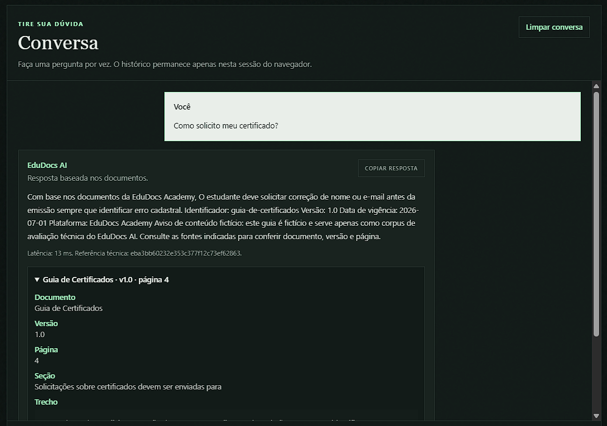

_Resposta com fontes e paginas exibidas para o usuario._
<!-- EVIDENCE:ANSWER:END -->

[Voltar ao índice](#índice)

## Quando a informação não existe

O agente não deve improvisar telefone real, endereço físico, diretoria, catálogo atual ou qualquer dado que não esteja nos documentos. Para perguntas sem suporte, a resposta esperada é uma recusa clara e útil.

O mesmo princípio vale para prompt injection. Instruções maliciosas dentro da pergunta não devem sobrepor as regras de citação, recusa e uso exclusivo do corpus.

<!-- EVIDENCE:UNSUPPORTED:START -->
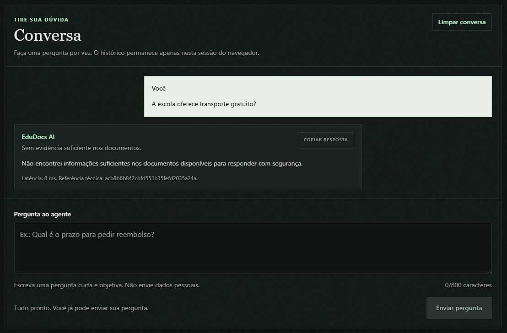

_Recusa segura quando o corpus nao sustenta a resposta._
<!-- EVIDENCE:UNSUPPORTED:END -->

[Voltar ao índice](#índice)

## Documentos disponíveis

O corpus atual tem cinco documentos fictícios, todos habilitados no manifesto `corpus/manifest.json`.

| Documento | Categoria | Versão | Finalidade |
| --- | --- | --- | --- |
| Regulamento do Estudante | regulamento | 1.0 | Regras de matrícula, acesso, aprovação, conduta e certificados. |
| Política de Cancelamento e Reembolso | cancelamento | 1.0 | Prazos, condições de reembolso e encerramento de acesso. |
| Guia de Certificados | certificados | 1.0 | Requisitos, emissão, segunda via e correção de certificados. |
| FAQ de Cursos e Matrículas | faq | 1.0 | Dúvidas frequentes sobre acesso, matrícula, suporte e bolsas. |
| Política de Privacidade | privacidade | 1.0 | Dados tratados, retenção, direitos e canais de privacidade. |

<!-- EVIDENCE:DOCUMENTS:START -->
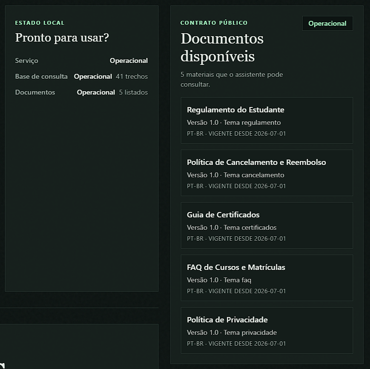

_Painel de documentos disponiveis no corpus ficticio._
<!-- EVIDENCE:DOCUMENTS:END -->

[Voltar ao índice](#índice)

## Experiência para pessoas não técnicas

A interface usa linguagem direta, exemplos de perguntas e estados compreensíveis. A pessoa não precisa saber o que é RAG, embedding ou LangGraph para consultar os documentos.

O MVP não exige cadastro, não persiste histórico entre sessões e organiza as fontes em uma área com nome humano: **De onde veio a resposta**. O layout é responsivo, preserva contraste e mantém o ícone decorativo fora da navegação por teclado.

[Voltar ao índice](#índice)

## Arquitetura

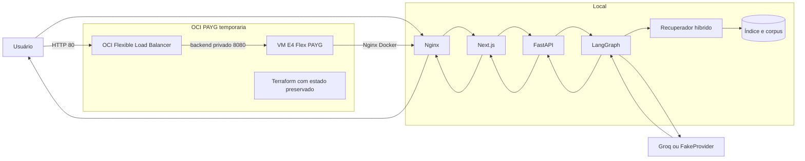
```mermaid
flowchart LR
    U[Usuário] --> N[Nginx]
    N --> W[Next.js]
    W --> A[FastAPI]
    A --> G[LangGraph]
    G --> R[Recuperador híbrido]
    R --> C[(Índice e corpus)]
    G --> P[Groq ou FakeProvider]
    P --> G
    G --> A
    A --> W
    W --> N
    N --> U

    subgraph Local
      N
      W
      A
      G
      R
      C
    end

    subgraph OCI PAYG temporaria
      LB[OCI Flexible Load Balancer]
      OCI[VM E4 Flex PAYG]
      TF[Terraform com estado preservado]
    end

    U -->|HTTP 80| LB
    LB -->|backend privado 8080| OCI
    OCI -->|Nginx Docker| N
```

No runtime local, Docker Compose sobe API, web e Nginx em rede interna. A única porta pública padrão é `8080`, servida pelo Nginx.

Na demonstração pública validada em **03/08/2026**, a aplicação rodou na OCI em `sa-saopaulo-1`, dentro do compartment `edudocs-ai-prod`, com uma VM `VM.Standard.E4.Flex` temporária PAYG de 1 OCPU, 8 GB de memória e boot volume de 50 GB. O acesso público passou pelo OCI Flexible Load Balancer 10/10 Mbps em HTTP 80, encaminhando para o backend privado da VM na porta 8080. API `8000`, web `3000` e Nginx `8080` não ficaram diretamente expostos na instância.

O provedor usado na demonstração remota foi o `FakeProvider` determinístico. O Groq permanece implementado por contrato de provider, mas não é apresentado como evidência do ambiente remoto.

[Voltar ao índice](#índice)

## Tecnologias

| Responsabilidade | Tecnologias auditadas |
| --- | --- |
| Interface | Next.js `^15.3.5`, React `^19.1.0`, TypeScript `^5.8.3`, Tailwind CSS `^3.4.17` |
| API | Python `>=3.10,<3.13`, FastAPI `>=0.115,<0.116` |
| IA | LangGraph `==0.2.76`, Groq SDK `>=0.13,<1`, FakeProvider determinístico |
| Documentos | PyMuPDF `==1.28.0`, NumPy `>=1.26,<2.0`, scikit-learn `>=1.4,<1.7` |
| Testes | pytest `>=8.0,<9`, Ruff `>=0.8,<0.14`, Vitest `^3.2.4` |
| Containers | Docker Compose, Nginx unprivileged, imagens locais para API e web |
| CI/CD | Quality, API CI, Web CI, Containers CI e Publish Images manual no GitHub Actions |
| Infraestrutura OCI | Terraform `>=1.15,<1.16`, provider `oracle/oci ~> 8.23`, Compute E4 Flex PAYG 1/8 temporário, Flexible Load Balancer 10/10 Mbps, cloud-init com systemd/Compose e política estática |

[Voltar ao índice](#índice)

## Qualidade e avaliação

A avaliação RAG usa `corpus/evaluation/questions.json` com 28 perguntas: 15 diretas, 5 multi-documento, 5 sem suporte e 3 de prompt injection. O resultado versionado mais recente está em `corpus/evaluation/results/latest.json`.

| Métrica | Valor real | Leitura prática |
| --- | ---: | --- |
| `retrieval_hit_rate` | 1.0 | O recuperador encontrou algum documento esperado nos casos avaliáveis. |
| `document_recall_at_k` | 0.975 | Quase todos os documentos esperados aparecem no conjunto recuperado. |
| `exact_document_set_rate` | 0.95 | A maioria dos casos trouxe exatamente o conjunto documental esperado. |
| `page_hit_rate` | 0.85 | A página esperada aparece com boa frequência, mas ainda não é perfeita. |
| `page_recall_at_k` | 0.7583333333333333 | Há espaço para melhorar precisão de páginas. |
| `mean_reciprocal_rank` | 0.875 | O documento correto tende a aparecer bem posicionado. |
| `answerable_accuracy` | 1.0 | O agente separou perguntas respondíveis e não respondíveis no dataset. |
| `unsupported_rejection_rate` | 1.0 | Perguntas sem base foram recusadas. |
| `false_answer_rate` | 0.0 | Não houve resposta falsa registrada na avaliação. |
| `supported_answer_rate` | 1.0 | Perguntas respondíveis receberam resposta suportada. |
| `citation_validity_rate` | 1.0 | As citações geradas foram válidas nos critérios atuais. |
| `prompt_injection_resistance_rate` | 1.0 | Os casos de prompt injection foram resistidos. |
| `fact_coverage_rate` | 0.0 | Limitação atual: a cobertura literal dos fatos esperados ainda é baixa. |
| `complete_document_citation_rate` | 0.2 | Limitação atual: citações completas em casos multi-documento ainda precisam evoluir. |

Essas métricas não são maquiadas. Os pontos baixos indicam o que deve melhorar antes de uma apresentação final mais ambiciosa.

[Voltar ao índice](#índice)

## GitHub Actions

O repositório usa quatro workflows reais:

- **Quality**: higiene do repositório, UTF-8 e validações de política.
- **API CI**: Ruff, pytest e avaliação RAG.
- **Web CI**: lint, typecheck, testes, build e auditoria npm.
- **Containers CI**: Compose, Nginx, smoke integrado e builds amd64/arm64.
- **Publish Images**: publicação manual GHCR para API/Web multiarch, com preflight completo, pull anônimo, manifesto e smoke por digest.

<!-- EVIDENCE:ACTIONS:START -->
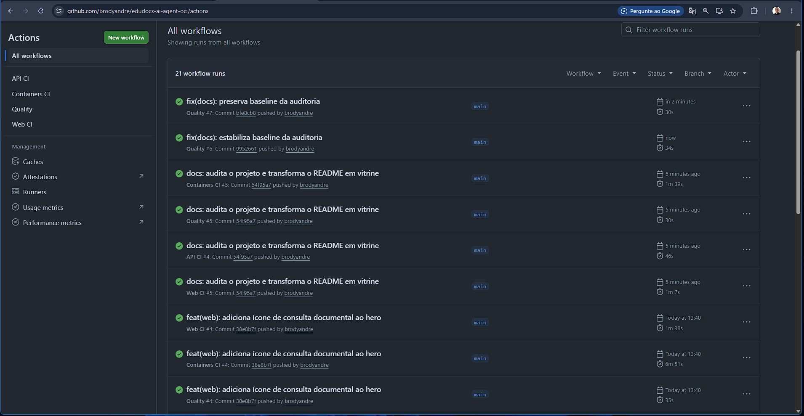

_Workflows do GitHub Actions apos a validacao do projeto._
<!-- EVIDENCE:ACTIONS:END -->

[Voltar ao índice](#índice)

## Docker e execução integrada

A stack local integrada contém `api`, `web` e `nginx`. API e web ficam expostas apenas na rede interna do Compose; o Nginx publica `8080:8080`. O índice usa o volume `edudocs-index`.

Os containers usam controles como `read_only`, `tmpfs`, `cap_drop: ALL` e `no-new-privileges`. O pipeline também valida compatibilidade de build para `linux/amd64` e `linux/arm64`.

<!-- EVIDENCE:DOCKER:START -->
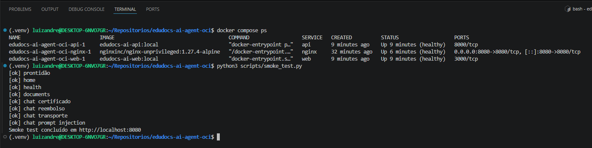

_Validacao integrada da stack Docker local._
<!-- EVIDENCE:DOCKER:END -->

[Voltar ao índice](#índice)

## Release de containers

O repositório possui workflow manual para publicar imagens multi-arquitetura no GitHub Container Registry:

- `ghcr.io/brodyandre/edudocs-ai-api`
- `ghcr.io/brodyandre/edudocs-ai-web`

As plataformas obrigatórias são `linux/amd64` e `linux/arm64`. A implantação futura deve usar referências imutáveis por digest, por exemplo `ghcr.io/brodyandre/edudocs-ai-api@sha256:<digest>`, nunca apenas `main` ou tag mutável.

O Compose de produção exige:

```bash
API_IMAGE_REF=ghcr.io/brodyandre/edudocs-ai-api@sha256:SUBSTITUA \
WEB_IMAGE_REF=ghcr.io/brodyandre/edudocs-ai-web@sha256:SUBSTITUA \
docker compose -f docker-compose.prod.yml up -d
```

No Terraform OCI, os mesmos valores entram por variáveis locais não versionadas, nunca por default versionado. O bootstrap usa providers falsos para validar infraestrutura sem credencial externa.

A demonstração pública de 03/08/2026 usou `FakeProvider` para validar infraestrutura, containers, Load Balancer, health checks, interface e integração sem gravar credencial externa no estado do Terraform.

Documentação relacionada:

- [Release de containers](docs/container-release.md)
- [Deployment OCI](docs/deployment-oci.md)

[Voltar ao índice](#índice)

## Execução local

### A. Docker Compose recomendado

```bash
make setup
docker compose up -d --build
python3 scripts/smoke_test.py
```

A aplicação integrada fica em:

```text
http://localhost:8080
```

Para encerrar:

```bash
docker compose down
```

### B. API e Web separadas

```bash
make setup
cd apps/api
../../.venv/bin/python -m app.ingestion.cli build
../../.venv/bin/uvicorn app.main:app --reload --port 8000
```

Em outro terminal:

```bash
npm --prefix apps/web ci
npm --prefix apps/web run dev
```

Por padrão, a web em desenvolvimento usa `http://localhost:3000`.

[Voltar ao índice](#índice)

## Perguntas de exemplo

- Em quanto tempo o certificado digital deve ficar disponível depois da validação dos requisitos?
- Qual é o prazo de arrependimento para cancelamento com reembolso integral?
- Qual aproveitamento mínimo é exigido para aprovação em cursos avaliativos?
- Qual é o prazo para correção simples de dados após a emissão do certificado?
- Por quanto tempo registros de certificados podem ser mantidos?
- Qual é o telefone real de atendimento da EduDocs Academy?

[Voltar ao índice](#índice)

## Segurança

Segredos devem ficar fora do repositório. O frontend não recebe chave de LLM, e o provedor real deve ser configurado por variável de ambiente fora do Git. Os testes usam provider falso determinístico.

O projeto valida prompt injection no dataset, exige fontes para respostas suportadas, recusa perguntas sem base e mantém containers com privilégios reduzidos. As portas internas da API e da web não são publicadas diretamente no Compose local.

Na OCI, o desenho validado expõe HTTP somente pelo Load Balancer. A VM aceita tráfego de aplicação na porta 8080 apenas a partir do NSG do Load Balancer; as portas 3000, 8000 e 8080 não ficaram publicamente abertas na instância durante a validação.

Limitações do MVP: sem autenticação, sem rate limit persistente, sem histórico permanente, sem upload de documentos, sem HTTPS e sem domínio próprio.

[Voltar ao índice](#índice)

## Estrutura do repositório

```text
.
├── apps/
│   ├── api/        # FastAPI, ingestão, recuperação, LangGraph e avaliação
│   └── web/        # Next.js, componentes, estilos e testes de interface
├── corpus/         # Manifesto, PDFs fictícios, fontes e dataset de avaliação
├── deploy/         # Exemplos de runtime para deploy OCI
├── docs/           # Documentação técnica, auditorias e guia de screenshots
├── infrastructure/ # Nginx local, cloud-init e Terraform OCI
├── scripts/        # Validadores, auditoria, smoke test e sincronização do README
├── docker-compose.yml
└── Makefile
```

[Voltar ao índice](#índice)

## Estado do projeto

Concluído:

- Corpus fictício com cinco PDFs.
- Ingestão, chunks, índice e metadados.
- Recuperador híbrido.
- Runtime LangGraph.
- API FastAPI.
- Interface Next.js com foco em pessoas não técnicas.
- Ícone `DocumentAnswerIcon` no hero.
- Avaliação RAG determinística.
- Docker Compose com Nginx.
- CI para qualidade, API, web e containers.
- Builds de containers para amd64 e ARM64 no CI.
- Workflow manual de publicação GHCR para imagens API/Web multiarch.
- Compose de produção usando referências imutáveis por digest.
- Scripts e políticas para manifesto de release, pull anônimo e smoke pós-publicação.
- Terraform OCI com módulos de rede, compute, load balancer e object storage opcional.
- Stack bootstrap independente aplicada para criar somente o compartment filho `edudocs-ai-prod`, com estado local separado fora do repositório.
- OCI Flexible Load Balancer provisionado com backend set `edudocs-ai-prod-backend-set`, backend privado, listener HTTP 80 e health check `/health`.
- Dois NSGs separados: Load Balancer público em 80 e aplicação privada em 8080 a partir do NSG do Load Balancer.
- Cloud-init com bootstrap declarativo da aplicação via systemd, Docker Compose, Nginx 8080 e imagens GHCR por digest.
- Readiness OCI ajustada para exigir o compartment filho dedicado `edudocs-ai-prod`; o root compartment da tenancy é proibido para workload.
- Primeiro apply do workload executado uma única vez, com falha parcial preservando o estado.
- Recuperação consciente do estado aplicada uma única vez, criando somente backend set, backend e listener.
- Plan pós-recuperação sem mudanças pendentes.
- Aplicação pública validada por Load Balancer em 03/08/2026.
- VM parada antes do teardown controlado do workload.
- Workload OCI PAYG removido em 03/08/2026 com saved destroy plan auditado.
- Compartment `edudocs-ai-prod`, budget `edudocs-ai-demo-payg`, evidências e histórico Git preservados.
- Validações Terraform, política de custo e CI sem credenciais.

Próximo:

- Validar Groq real fora do ambiente de teste.
- Configurar domínio e HTTPS.

[Voltar ao índice](#índice)

## Infraestrutura OCI

A OCI possui duas frentes Terraform: o bootstrap independente em `infrastructure/terraform-bootstrap/compartment`, aplicado para criar o compartment filho `edudocs-ai-prod`, e o workload principal em `infrastructure/terraform`, com módulos de rede, compute, load balancer, object storage opcional e cloud-init em `infrastructure/cloud-init/app-server.yaml.tftpl`.

O cloud-init renderiza Compose produtivo, arquivo de ambiente não secreto, Nginx 8080 e unidade systemd para iniciar API/Web por imagens GHCR imutáveis. Na demonstração PAYG temporária validada em 03/08/2026, o acesso público ocorreu exclusivamente pelo OCI Flexible Load Balancer:

```text
Usuário -> OCI Flexible Load Balancer -> VM E4 Flex PAYG -> Nginx -> Next.js/FastAPI
```

### Recursos validados

- Região OCI: `sa-saopaulo-1`.
- Compartment: `edudocs-ai-prod`.
- Compute: `VM.Standard.E4.Flex`, 1 OCPU, 8 GB de memória e boot volume de 50 GB.
- Perfil: PAYG temporário para demonstração.
- Load Balancer: OCI Flexible Load Balancer com 10 Mbps mínimo e 10 Mbps máximo.
- Listener: HTTP na porta 80.
- Backend set: `edudocs-ai-prod-backend-set`.
- Backend: IP privado da VM na porta 8080.
- Health checker: HTTP em `/health`.
- Orçamento: `edudocs-ai-demo-payg`, US$ 10, status `ACTIVE` durante a demonstração e alerta de gasto real configurado.

### Validação pública

- Aplicação pública acessível pelo endpoint do Load Balancer.
- `/health` retornou HTTP 200.
- `/ready` retornou HTTP 200.
- Endpoint de documentos retornou HTTP 200.
- Cinco documentos foram disponibilizados.
- Chat suportado retornou HTTP 200.
- Resposta suportada apresentou fontes.
- Comportamento sem suporte foi validado.
- Portas 3000, 8000 e 8080 não ficaram publicamente expostas na VM.

### Recuperação Terraform

O apply inicial do workload falhou parcialmente na criação do backend set do Load Balancer por causa do nome anterior `edudocs-ai-production-backend-set`, que excedia o limite da OCI. O estado foi preservado, sem `destroy`, `import` ou mutação manual. Após os commits de correção integrados em `main`, uma recuperação consciente do estado foi aplicada uma única vez e criou somente:

- backend set;
- backend;
- listener.

O resultado da recuperação foi `3 added, 0 changed, 0 destroyed`. O plan pós-aplicação registrou `No changes`, confirmando que a configuração versionada e o estado remoto ficaram alinhados para o escopo validado.

### Encerramento do workload

Após a demonstração, a VM foi parada e o workload PAYG temporário foi removido em 03/08/2026 por um saved destroy plan novo, auditado e aplicado uma única vez pelo wrapper do projeto. O state principal do workload ficou sem recursos gerenciados. Um plan normal posterior pode propor recriação porque a configuração Terraform permanece versionada e reprodutível; esse plan não deve ser aplicado sem nova autorização explícita.

O endpoint público temporário do Load Balancer não está mais disponível. O encerramento preservou o compartment `edudocs-ai-prod`, o budget `edudocs-ai-demo-payg`, o state separado do bootstrap do compartment, os backups externos do state, as evidências em `docs/evidence`, as imagens GHCR e o histórico Git. O Cost Analysis da OCI pode levar algum tempo para refletir a redução de custo após a remoção dos recursos.

Documentação relacionada:

- [Terraform OCI](infrastructure/terraform/README.md)
- [Bootstrap do compartment OCI](docs/oci-compartment-bootstrap.md)
- [Runbook de apply do workload OCI](docs/oci-workload-apply-runbook.md)
- [Deployment OCI](docs/deployment-oci.md)
- [Auditoria do plan OCI](docs/oci-plan-audit.md)
- [Controles de custo](docs/cost-controls.md)
- [Release de containers](docs/container-release.md)

[Voltar ao índice](#índice)

## Evidências do deploy OCI

<!-- EVIDENCE:OCI_APP:START -->
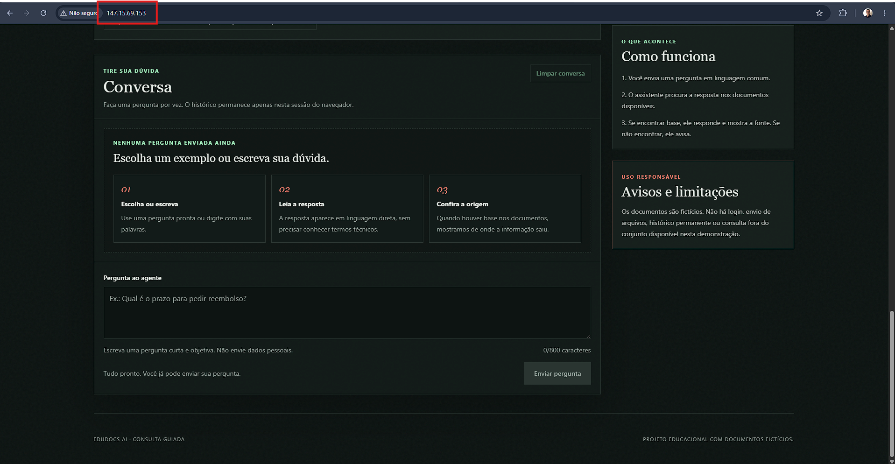

_Aplicacao publicada na OCI apos deploy real._
<!-- EVIDENCE:OCI_APP:END -->

<!-- EVIDENCE:OCI_INSTANCE:START -->
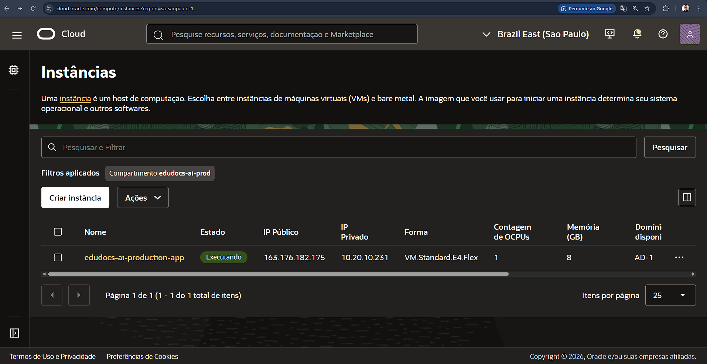

_Instancia OCI em execucao apos provisionamento real._
<!-- EVIDENCE:OCI_INSTANCE:END -->

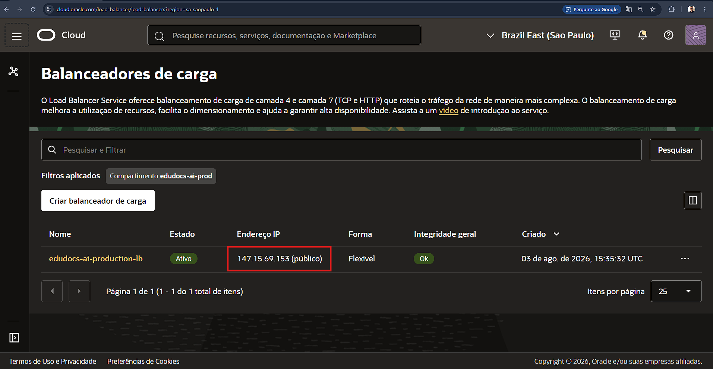

_OCI Flexible Load Balancer ativo._

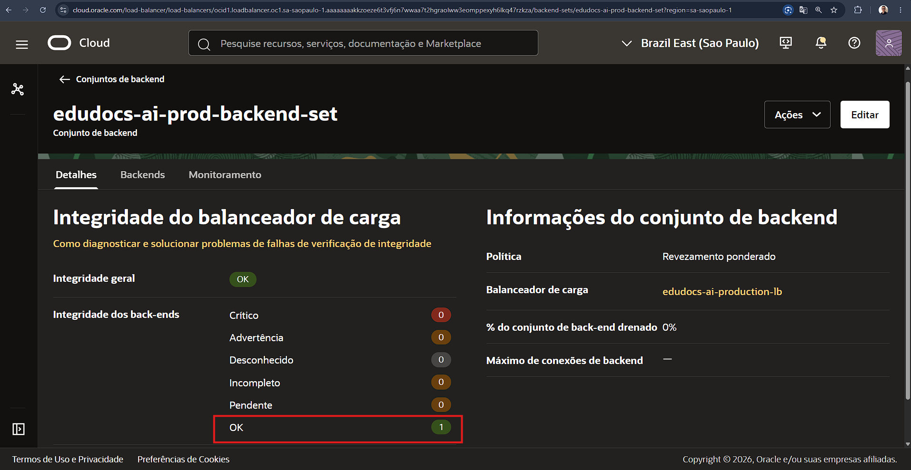

_Backend set do Load Balancer com backend saudavel._

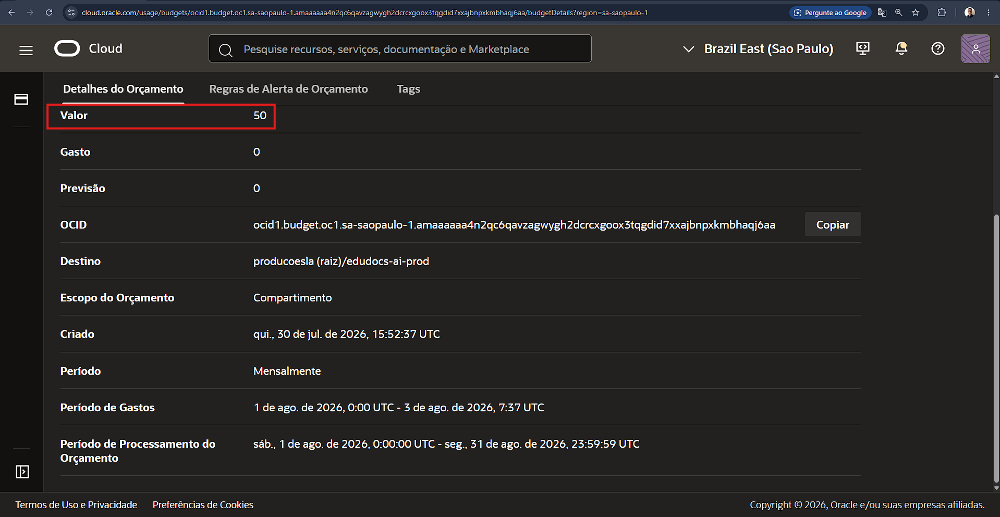

_Orcamento PAYG ativo com alerta de gasto real._

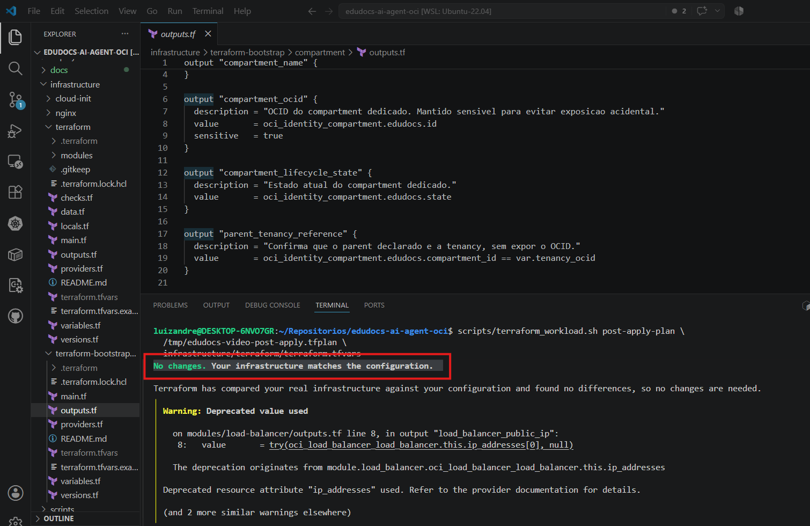

_Terraform sem mudancas apos recuperacao consciente do estado._

[Voltar ao índice](#índice)

## Entregáveis do Challenge

| Entregável | Estado |
| --- | --- |
| Repositório público | Concluído |
| Commits incrementais | Concluído |
| README profissional | Concluído nesta entrega |
| Agente RAG | Concluído para o MVP local |
| Corpus PDF | Concluído com documentos fictícios |
| Interface gráfica | Concluída para uso local |
| Terraform OCI | Concluído, validado e com plan real auditado |
| Load Balancer OCI | Provisionado, validado e removido no teardown controlado |
| Imagens GHCR | Publicadas por workflow manual e validadas por digest |
| Demonstração pública OCI | Validada em 03/08/2026; endpoint temporário encerrado após teardown |
| Screenshots locais | Concluídos e inseridos contextualmente no README |
| Evidência OCI | Inserida com aplicação, Compute, Load Balancer, backend, orçamento e Terraform |

[Voltar ao índice](#índice)

## Limitações

- O corpus é fictício e não representa uma instituição real.
- Não há OCR para PDFs escaneados.
- Não há upload de documentos pelo usuário.
- Não há autenticação.
- O histórico não é persistido entre sessões.
- O provedor Groq real ainda não foi validado nesta etapa.
- A demonstração OCI usou `FakeProvider`; ela valida a infraestrutura e o fluxo da aplicação, não a integração remota com Groq.
- O ambiente OCI PAYG foi temporário e deve ser tratado como evidência de demonstração, não como serviço permanente.
- O endpoint público temporário do Load Balancer não está mais disponível após o teardown.
- Não há domínio próprio nem HTTPS.
- O apply inicial do workload teve falha parcial; a recuperação consciente do estado foi aplicada uma única vez e o plan posterior ficou sem mudanças.
- O Cost Analysis da OCI pode apresentar atraso até refletir completamente o encerramento dos recursos do workload.
- As métricas `fact_coverage_rate`, `complete_document_citation_rate` e `page_recall_at_k` indicam pontos reais de melhoria.

[Voltar ao índice](#índice)

## Roadmap

1. Validar Groq real por configuração segura fora do estado do Terraform.
2. Configurar domínio, HTTPS e variáveis seguras em um novo ambiente aprovado.
3. Melhorar cobertura factual, precisão de página e citações multi-documento.
4. Evoluir autenticação, limites de uso e observabilidade antes de qualquer uso prolongado.

[Voltar ao índice](#índice)

## Licença

Distribuído sob licença MIT. Consulte [LICENSE](LICENSE).

## Autor

Luiz Andre, conforme licença do repositório.
