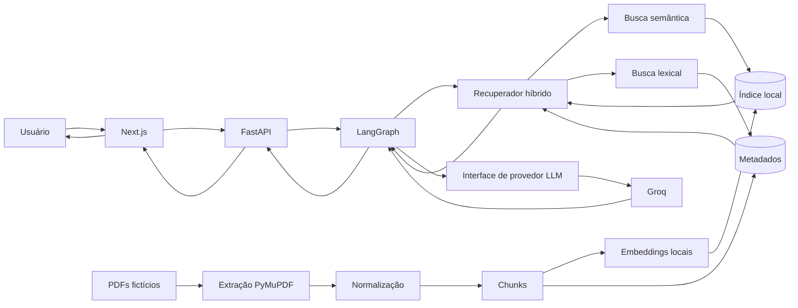

# Arquitetura do EduDocs AI

## 1. Contexto do Challenge

O Challenge exige um repositório público, organizado e evolutivo para demonstrar a construção de um agente de IA aplicado a documentos educacionais. Nesta etapa, o foco é registrar a arquitetura e as decisões técnicas antes de implementar código funcional.

## 2. Problema real resolvido

Documentos educacionais em PDF costumam concentrar regras, orientações e procedimentos, mas a consulta manual é lenta e sujeita a interpretações incompletas. O EduDocs AI propõe um agente que responda perguntas com base em trechos recuperados do corpus e informe as referências usadas.

## 3. Público-alvo

O público-alvo do MVP é composto por estudantes, equipes acadêmicas e avaliadores técnicos que precisem consultar rapidamente documentos educacionais fictícios preparados para o Challenge.

## 4. Objetivo geral

Projetar uma solução RAG localmente executável, preparada para deploy em OCI, capaz de responder perguntas sobre PDFs educacionais fictícios com citações por documento e página.

## 5. Objetivos específicos

- Organizar a base do repositório para API, interface, corpus, documentação e infraestrutura.
- Definir um pipeline de ingestão reproduzível para PDFs.
- Combinar busca semântica e lexical para melhorar a recuperação.
- Isolar o provedor de LLM por interface substituível.
- Permitir testes com provedor falso determinístico, sem consumo externo.
- Manter execução local com Docker Compose e preparar deploy em OCI Compute ARM64 via Terraform e OCI Flexible Load Balancer.

## 6. Requisitos funcionais

- Receber perguntas do usuário pela interface web planejada.
- Enviar perguntas para uma API HTTP planejada.
- Executar fluxo de orquestração com LangGraph.
- Recuperar evidências por busca híbrida.
- Gerar respostas somente quando houver contexto suficiente.
- Apresentar citações por documento e página.
- Ingerir PDFs fictícios do corpus local.
- Persistir índice e metadados localmente.

## 7. Requisitos não funcionais

- Manter segredos fora do repositório e do frontend.
- Usar arquivos UTF-8 sem BOM e LF.
- Ser executável localmente por Docker Compose em etapa futura.
- Evitar dependências desnecessárias.
- Ser compatível com ARM64 para OCI Compute.
- Registrar logs estruturados e sanitizados.
- Permitir testes determinísticos sem chamadas externas.

## 8. Limites do MVP

O MVP não inclui autenticação, OCR, upload público de documentos, Kubernetes, banco relacional, painel administrativo, edição de documentos, treinamento de modelos ou execução de workflows assíncronos complexos.

## 9. Componentes da solução

- **Interface web**: Next.js, React, TypeScript e Tailwind CSS.
- **API**: FastAPI em Python para receber perguntas e expor endpoints planejados.
- **Orquestração**: LangGraph para controlar recuperação, avaliação de suficiência e geração.
- **Recuperador híbrido**: combina busca semântica e lexical.
- **Índice local**: armazena vetores, metadados e referências de chunks.
- **Extração de PDFs**: PyMuPDF para leitura página a página.
- **LLM**: Groq inicialmente, isolado por contrato de provedor.
- **Infraestrutura**: Docker Compose local, Nginx e Terraform OCI validável para Compute ARM64 com Flexible Load Balancer 10 Mbps.

## 10. Diagrama Mermaid da arquitetura

## 11. Fluxo completo de uma pergunta

1. O usuário envia uma pergunta pela interface planejada.
2. A interface chama a API FastAPI.
3. A API cria uma execução do grafo LangGraph compilado, que é o runtime operacional do agente.
4. O grafo normaliza a pergunta e chama o recuperador híbrido.
5. O recuperador consulta índice vetorial e busca lexical.
6. Os resultados são fundidos, deduplicados e avaliados.
7. Se houver evidência suficiente, o provedor de LLM gera uma resposta ancorada nos trechos.
8. A API devolve resposta, citações e metadados de rastreabilidade.
9. Se não houver evidência suficiente, a resposta deve recusar a inferência.

## 12. Fluxo de ingestão dos PDFs

1. Ler PDFs fictícios do diretório de corpus.
2. Extrair texto página a página com PyMuPDF.
3. Normalizar quebras, espaços e marcadores.
4. Detectar seções quando possível.
5. Criar chunks com sobreposição controlada.
6. Gerar hash por chunk.
7. Gerar embeddings locais.
8. Persistir índice e metadados.

## 13. Armazenamento do índice e metadados

O índice local planejado ficará em `corpus/index/`, que não deve versionar artefatos gerados. Os metadados devem manter documento, título, versão, página, seção, índice do chunk e hash para permitir citações e auditoria das respostas.

## 14. Integração com o provedor de LLM

O acesso ao LLM será feito por uma interface de provedor. A primeira implementação planejada usará Groq por variável de ambiente, enquanto testes usarão um provedor falso determinístico para evitar consumo externo e resultados instáveis.

## 15. Execução local

A execução local usa Docker Compose para subir API, interface, Nginx e volume do índice. A porta pública local padrão é `8080` pelo Nginx.

## 16. Deploy na OCI

O deploy planejado usa OCI Flexible Load Balancer público como único endpoint HTTP, encaminhando para Nginx em Docker na VM Ampere A1 pela porta privada 8080. O código em `infrastructure/terraform` cria VCN, subnet pública, dois NSGs, instância A1 Flex, Load Balancer flexível 10/10 Mbps, cloud-init e bucket privado opcional. Ainda não houve `terraform plan`, `apply` ou deploy real.

## 17. Compatibilidade ARM64

As imagens Docker e dependências Python/Node devem ser escolhidas com suporte a ARM64. Bibliotecas nativas devem ser validadas em ambiente compatível antes da entrega final.

## 18. Observabilidade mínima

O MVP deve registrar logs estruturados, tempo de recuperação, quantidade de chunks usados, identificação não sensível da requisição e erros sanitizados. Métricas avançadas ficam para versões futuras.

## 19. Riscos técnicos

- PDFs com texto mal extraído.
- Recuperação com contexto insuficiente.
- Dependências sem bom suporte ARM64.
- Latência do provedor externo de LLM.
- Prompt injection dentro dos documentos.
- Citações inconsistentes se metadados forem incompletos.

## 20. Mitigações

- Criar corpus fictício controlado.
- Validar hashes e metadados na ingestão.
- Usar provedor falso determinístico nos testes.
- Recusar respostas sem evidência suficiente.
- Sanitizar logs e entradas.
- Testar dependências em ambiente ARM64 antes do deploy.

## 21. Decisões adiadas para versões futuras

- Autenticação e autorização.
- OCR para PDFs escaneados.
- Upload público de documentos.
- Banco relacional.
- Painel administrativo.
- Avaliação automática com métricas de qualidade.
- Observabilidade com tracing e dashboards.
